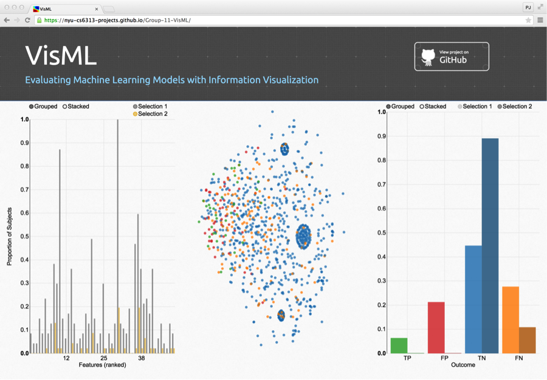

# VisML

Though not often explored, interactive visualization techniques can be helpful for machine learning researchers to explore their models after training. By visually exploring the output, developers can more easily identify patterns in the data, detect anomolies, and explore high-dimensional data to understand where and how the model can be improved.  In this paper, we describe our preliminary work exploring the use of interactive visualization for model evaluation. 

A live demo can be found [here](https://NYU-CS6313-Projects.github.io/Group-11-VisML/).

